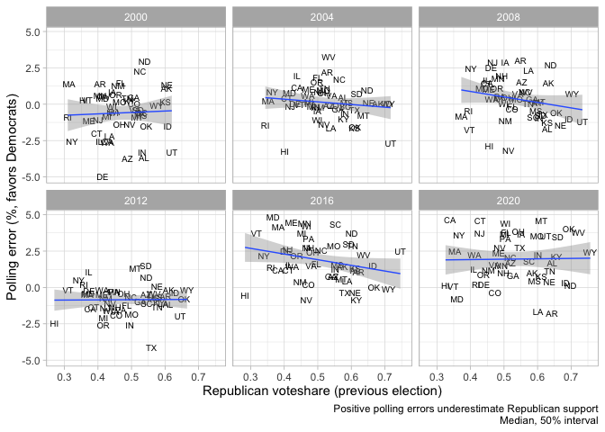

Polling error and measurement error by day before the election
================

### Coefficient model

*α* = logit<sup> − 1</sup>(*μ* + *β**t*)

``` r
alpha <- read_csv(file = "data/model_output/model_polls/components/polling_error_measurement_error/by_day_coefficient_model_alpha.Rds")

ggplot(alpha, aes(x = d, y = q50)) +
  geom_line() +
  geom_ribbon(aes(ymin = q25, ymax = q75), alpha = 0.5) +
  geom_ribbon(aes(ymin =q10, ymax = q90), alpha = 0.25) +
  theme_light() +
  facet_wrap(t~.) +
  scale_x_reverse() + 
  labs(x = "Days to election",
       y = "1 - lambda (share of 'noise')")
```

<!-- -->

``` r
state_error <- read_csv(file = "data/model_output/model_polls/components/polling_error_measurement_error/by_day_coefficient_model_state_error.Rds")
```

    ## 
    ## ── Column specification ────────────────────────────────────────────────────────
    ## cols(
    ##   t = col_double(),
    ##   s = col_character(),
    ##   dem_share = col_double(),
    ##   q50 = col_double(),
    ##   q25 = col_double(),
    ##   q75 = col_double(),
    ##   q10 = col_double(),
    ##   q90 = col_double(),
    ##   bigger0 = col_double()
    ## )

``` r
ggplot(data = state_error %>%
         filter(s != "DC"), aes(x = 1 - inv.logit(dem_share), y = q50)) +
  #geom_point(size = 0.5) +
  geom_text(aes(label = s), size = 2.5) +
  #geom_errorbar(aes(ymin = q25, ymax = q75), width = 0, size= 0.5) +
  geom_smooth(method = "lm", size = 0.5) +
  labs(caption = "Positive polling errors underestimate Republican support
               Median, 50% interval",
       x = "Republican voteshare (previous election)",
       y = "Polling error (%, favors Democrats)") +
  theme_light() +
  facet_wrap(t ~.)
```

    ## `geom_smooth()` using formula 'y ~ x'

<!-- -->

Model

    data {
      int N_state;
      int N_national;
      int S; // State
      int T; // Year
      int t_state_before_election[N_state];
      int t_national_before_election[N_national];
      int t_state[N_state];
      int t_national[N_national];
      int s[N_state];
      int x[N_state];
      int y_state[N_state];
      int n_state[N_state];
      int n_national[N_national];
      int y_national[N_national];
      vector[N_state] outcome_state;
      vector[N_national] outcome_national;
      matrix[T, S] turnout_weights;
    }
    transformed data {
      vector[N_national] logit_outcome_national;
      vector[N_state] logit_outcome_state;
      vector[N_state] ones_state = rep_vector(1, N_state);
      vector[N_national] ones_national = rep_vector(1, N_national);
      logit_outcome_national = logit(outcome_national);
      logit_outcome_state = logit(outcome_state);
    }
    parameters {
      real<lower = 0.00001> xi_sigma;
      vector[S * T] raw_xi;
      vector[21] raw_alpha;
      real<lower = 0.00001> alpha_sigma;
    }
    transformed parameters {
      vector[T] xi_national;
      vector[S * T] xi; // S1 1, S2 1, S3 1, ..., S1 2 (300)
      vector[21] alpha;
      vector[21] inv_logit_alpha;
      xi = xi_sigma * raw_xi;
      for (tt in 1:T){
        xi_national[tt] = logit(turnout_weights[tt] * inv_logit(xi[(1 + (tt - 1) * S):(tt * S)]));
      }
      alpha[21] = raw_alpha[21] * alpha_sigma;
      for (tt in 1:20){
        alpha[21 - tt] = alpha[22 - tt] + raw_alpha[21 - tt] * alpha_sigma;
      }
      inv_logit_alpha = inv_logit(alpha);
    }
    model {
      raw_alpha ~ std_normal();
      alpha_sigma ~ normal(0, 1);
      xi_sigma ~ normal(0, 1);
      to_vector(raw_xi) ~ std_normal();
      y_state ~ binomial(n_state, inv_logit_alpha[t_state_before_election] .* inv_logit(logit_outcome_state + xi[x]) +
        (1 - inv_logit_alpha[t_state_before_election]) * 0.5);
      y_national ~ binomial(n_national, inv_logit_alpha[t_national_before_election] .* inv_logit(logit_outcome_national +
        xi_national[t_national]) + (1 - inv_logit_alpha[t_national_before_election]) * 0.5);
    }
    generated quantities {
      matrix[S, T] mu_matrix;
      for (tt in 1:T){
        mu_matrix[:, tt] = xi[((tt - 1) * S + 1):(tt * S)];
      }
    }
